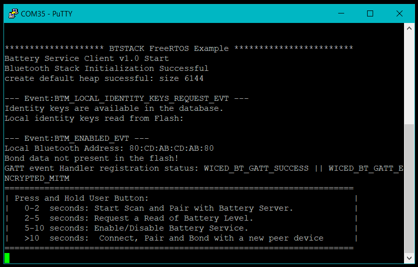

# BTSTACK: Bluetooth&reg; LE Battery Service Client

This code example demonstrates the implementation of the Bluetooth&reg; LE Battery Service Client using the Infineon&reg; AIROC&trade; CYW20829 Bluetooth&reg; chip and PSoC&trade; 6 MCU with AIROC&trade; Bluetooth&reg; LE with ModusToolbox™ software environment.

The Battery Service Client application is designed to connect to and access services of the Battery Service Server application. The Battery Service Client connects to a device advertising the Battery Service UUID.

 - Registration with the LE stack for various events
 - Read characteristics from a Battery Service Server device
 - Process the notifications received from the server device

[View this README on GitHub.](https://github.com/Infineon/mtb-example-btstack-freertos-battery-client)

[Provide feedback on this code example.](https://cypress.co1.qualtrics.com/jfe/form/SV_1NTns53sK2yiljn?Q_EED=eyJVbmlxdWUgRG9jIElkIjoiQ0UyMzU5NDgiLCJTcGVjIE51bWJlciI6IjAwMi0zNTk0OCIsIkRvYyBUaXRsZSI6IkJUU1RBQ0s6IEJsdWV0b290aCZyZWc7IExFIEJhdHRlcnkgU2VydmljZSBDbGllbnQiLCJyaWQiOiJsbmd1eWVuIiwiRG9jIHZlcnNpb24iOiIxLjEuMCIsIkRvYyBMYW5ndWFnZSI6IkVuZ2xpc2giLCJEb2MgRGl2aXNpb24iOiJNQ0QiLCJEb2MgQlUiOiJJQ1ciLCJEb2MgRmFtaWx5IjoiQlRBQkxFIn0=)
## Requirements

- [ModusToolbox&trade; software](https://www.infineon.com/modustoolbox) v3.0 or later (tested with v3.0)
- Board support package (BSP) minimum required version for:
   - CY8CKIT-062-BLE : v4.0.0
   - CY8CPROTO-063-BLE : v4.0.0
   - CYBLE-416045-EVAL : v4.0.0
   - CYW920829M2EVB-01 : release v1.0.0 beta
- Programming language: C
- Associated parts: [AIROC&trade; CYW20829 Bluetooth&reg; LE SoC](https://www.infineon.com/cms/en/product/promopages/airoc20829), [PSoC&trade; 6 MCU with AIROC&trade; Bluetooth&reg; LE](https://www.infineon.com/cms/en/product/microcontroller/32-bit-psoc-arm-cortex-microcontroller/psoc-6-32-bit-arm-cortex-m4-mcu/psoc-63/)


## Supported toolchains (make variable 'TOOLCHAIN')

- GNU Arm&reg; embedded compiler v10.3.1 (`GCC_ARM`) - Default value of `TOOLCHAIN`
- Arm&reg; compiler v6.16 (`ARM`)
- IAR C/C++ compiler v9.30.1 (`IAR`)

## Supported kits (make variable 'TARGET')

- [AIROC&trade; CYW20829 Bluetooth&reg; LE SoC](https://www.infineon.com/cms/en/product/promopages/airoc20829) (`CYW920829M2EVB-01`) – Default value of `TARGET`
- [PSoC&trade; 6 Bluetooth&reg; LE pioneer kit](https://www.infineon.com/CY8CKIT-062-BLE) (`CY8CKIT-062-BLE`)
- [PSoC&trade; 6 Bluetooth&reg; LE prototyping kit](https://www.infineon.com/CY8CPROTO-063-BLE) (`CY8CPROTO-063-BLE`)
- [EZ-BLE Arduino Evaluation Board](https://www.infineon.com/cms/en/product/evaluation-boards/cyble-416045-eval/) (`CYBLE-416045-EVAL`)

## Hardware setup

This example uses the board's default configuration. See the kit user guide to ensure that the board is configured correctly.

**Note:** The PSoC&trade; 6 Bluetooth&reg; LE pioneer kit (CY8CKIT-062-BLE) and the PSoC&trade; 6 Wi-Fi Bluetooth&reg; pioneer kit (CY8CKIT-062-WIFI-BT) ship with KitProg2 installed. The ModusToolbox&trade; software requires KitProg3. Before using this code example, make sure that the board is upgraded to KitProg3. The tool and instructions are available in the [Firmware Loader](https://github.com/Infineon/Firmware-loader) GitHub repository. If you do not upgrade, you will see an error like "unable to find CMSIS-DAP device" or "KitProg firmware is out of date".

The AIROC&trade; CYW20829 Bluetooth&reg; kit (CYW920829M2EVB-01) ships with KitProg3 version 2.30 installed. The ModusToolbox&trade; software requires KitProg3 with latest version 2.40. Before using this code example, make sure that the board is upgraded to KitProg3. The tool and instructions are available in the Firmware Loader GitHub repository. If you do not upgrade, you will see an error such as "unable to find CMSIS-DAP device" or "KitProg firmware is out of date".

## Software setup

Install a terminal emulator if you don't have one. Instructions in this document use [Tera Term](https://ttssh2.osdn.jp/index.html.en).

This example requires no additional software or tools.


## Using the code example

Create the project and open it using one of the following:

<details><summary><b>In Eclipse IDE for ModusToolbox&trade; software</b></summary>

1. Click the **New Application** link in the **Quick Panel** (or, use **File** > **New** > **ModusToolbox&trade; Application**). This launches the [Project Creator](https://www.infineon.com/ModusToolboxProjectCreator) tool.

2. Pick a kit supported by the code example from the list shown in the **Project Creator - Choose Board Support Package (BSP)** dialog.

   When you select a supported kit, the example is reconfigured automatically to work with the kit. To work with a different supported kit later, use the [Library Manager](https://www.infineon.com/ModusToolboxLibraryManager) to choose the BSP for the supported kit. You can use the Library Manager to select or update the BSP and firmware libraries used in this application. To access the Library Manager, click the link from the **Quick Panel**.

   You can also just start the application creation process again and select a different kit.

   If you want to use the application for a kit not listed here, you may need to update the source files. If the kit does not have the required resources, the application may not work.

3. In the **Project Creator - Select Application** dialog, choose the example by enabling the checkbox.

4. (Optional) Change the suggested **New Application Name**.

5. The **Application(s) Root Path** defaults to the Eclipse workspace which is usually the desired location for the application. If you want to store the application in a different location, you can change the *Application(s) Root Path* value. Applications that share libraries should be in the same root path.

6. Click **Create** to complete the application creation process.

For more details, see the [Eclipse IDE for ModusToolbox&trade; software user guide](https://www.infineon.com/MTBEclipseIDEUserGuide) (locally available at *{ModusToolbox&trade; software install directory}/docs_{version}/mt_ide_user_guide.pdf*).

</details>

<details><summary><b>In command-line interface (CLI)</b></summary>

ModusToolbox&trade; software provides the Project Creator as both a GUI tool and the command line tool, "project-creator-cli". The CLI tool can be used to create applications from a CLI terminal or from within batch files or shell scripts. This tool is available in the *{ModusToolbox&trade; software install directory}/tools_{version}/project-creator/* directory.

Use a CLI terminal to invoke the "project-creator-cli" tool. On Windows, use the command line "modus-shell" program provided in the ModusToolbox&trade; software installation instead of a standard Windows command-line application. This shell provides access to all ModusToolbox&trade; software tools. You can access it by typing `modus-shell` in the search box in the Windows menu. In Linux and macOS, you can use any terminal application.

The "project-creator-cli" tool has the following arguments:

Argument | Description | Required/optional
---------|-------------|-----------
`--board-id` | Defined in the `<id>` field of the [BSP](https://github.com/Infineon?q=bsp-manifest&type=&language=&sort=) manifest | Required
`--app-id`   | Defined in the `<id>` field of the [CE](https://github.com/Infineon?q=ce-manifest&type=&language=&sort=) manifest | Required
`--target-dir`| Specify the directory in which the application is to be created if you prefer not to use the default current working directory | Optional
`--user-app-name`| Specify the name of the application if you prefer to have a name other than the example's default name | Optional

The following example will clone the "[Bluetooth&reg; LE Battery Service Client](https://github.com/Infineon/mtb-example-btstack-freertos-battery-client)" application with the desired name "MyBatteryClient" configured for the *CYW920829M2EVB-01* BSP into the specified working directory, *C:/mtb_projects*:

   ```
   project-creator-cli --board-id CYW920829M2EVB-01 --app-id mtb-example-btstack-freertos-battery-client --user-app-name MyBatteryClient --target-dir "C:/mtb_projects"
   ```

**Note:** The project-creator-cli tool uses the `git clone` and `make getlibs` commands to fetch the repository and import the required libraries. For details, see the "Project creator tools" section of the [ModusToolbox&trade; software user guide](https://www.infineon.com/ModusToolboxUserGuide) (locally available at *{ModusToolbox&trade; software install directory}/docs_{version}/mtb_user_guide.pdf*).

To work with a different supported kit later, use the [Library Manager](https://www.infineon.com/ModusToolboxLibraryManager) to choose the BSP for the supported kit. You can invoke the Library Manager GUI tool from the terminal using `make library-manager` command or use the Library Manager CLI tool "library-manager-cli" to change the BSP.

The "library-manager-cli" tool has the following arguments:

Argument | Description | Required/optional
---------|-------------|-----------
`--add-bsp-name` | Name of the BSP that should be added to the application | Required
`--set-active-bsp` | Name of the BSP that should be as active BSP for the application | Required
`--add-bsp-version`| Specify the version of the BSP that should be added to the application if you do not wish to use the latest from manifest | Optional
`--add-bsp-location`| Specify the location of the BSP (local/shared) if you prefer to add the BSP in a shared path | Optional

<br />

Following example adds the CY8CKIT-062-BLE BSP to the already created application and makes it the active BSP for the app:

   ```
   library-manager-cli --project "C:/mtb_projects/MyBatteryClient" --add-bsp-name CY8CKIT-062-BLE --add-bsp-version "latest-v4.X" --add-bsp-location "local"

   library-manager-cli --project "C:/mtb_projects/MyBatteryClient" --set-active-bsp APP_CY8CKIT-062-BLE
   ```

</details>

<details><summary><b>In third-party IDEs</b></summary>

Use one of the following options:

- **Use the standalone [Project Creator](https://www.infineon.com/ModusToolboxProjectCreator) tool:**

   1. Launch Project Creator from the Windows Start menu or from *{ModusToolbox&trade; software install directory}/tools_{version}/project-creator/project-creator.exe*.

   2. In the initial **Choose Board Support Package** screen, select the BSP, and click **Next**.

   3. In the **Select Application** screen, select the appropriate IDE from the **Target IDE** drop-down menu.

   4. Click **Create** and follow the instructions printed in the bottom pane to import or open the exported project in the respective IDE.

<br />

- **Use command-line interface (CLI):**

   1. Follow the instructions from the **In command-line interface (CLI)** section to create the application.

   2. Export the application to a supported IDE using the `make <ide>` command.

   3. Follow the instructions displayed in the terminal to create or import the application as an IDE project.

For a list of supported IDEs and more details, see the "Exporting to IDEs" section of the [ModusToolbox&trade; software user guide](https://www.infineon.com/ModusToolboxUserGuide) (locally available at *{ModusToolbox&trade; software install directory}/docs_{version}/mtb_user_guide.pdf*).

</details>


## Operation

1. Connect the board to your PC using the provided USB cable through the KitProg3 USB connector.

2. Use your favorite serial terminal application and connect to the KitProg3 COM port. Configure the terminal application to access the serial port using the following settings.

   Baud rate: 115200 bps; Data: 8 bits; Parity: None; stop: 1 bit; Flow control: None; New line for receive data: Line Feed(LF) or auto setting

3. Program the board using one of the following:

   <details><summary><b>Using Eclipse IDE for ModusToolbox&trade; software</b></summary>

      1. Select the application project in the Project Explorer.

      2. In the **Quick Panel**, scroll down, and click **\<Application Name> Program (KitProg3_MiniProg4)**.

   </details>

   <details><summary><b>Using CLI</b></summary>

     From the terminal, execute the `make program` command to build and program the application using the default toolchain to the default target. The default toolchain is specified in the application's Makefile but you can override this value manually:
      ```
      make program TOOLCHAIN=<toolchain>
      ```

      Example:
      ```
      make program TOOLCHAIN=GCC_ARM
      ```
   </details>

4. After programming, the application starts automatically and wait for user button to be pressed.


## Instructions
To demonstrate the Battery Client app, a Battery Server app must be running on another eval board such as CYW920819EVB-02 or CYW920820EVB-02.

### Steps:

1. Start Battery Service Server for CYW920820EVB-02 eval board.
Fig 1 below shows a startup screen of Battery Server running on CYW920820EVB-02 board.

**Figure 1. Battery Service Server Start Screen**


2. Start Battery Service Client for CYW920829M2EVB-01 eval board.

**Figure 2. Battery Service Client Start Screen**



3. On application start, push the User button on the board and release within 2 seconds. This causes the Battery Service Client app to scan and connect to the Battery Service Server, which would have `UUID\_SERVICE\_BATTERY` in its advertisements.

4. If no Battery Service Server device is found nearby for 90 seconds, the scan stops automatically. To restart the scan, push the button on the board and release within 2 secs.

5. Upon successful connection, the Battery Service Client app will discover all the characteristics/descriptors of the server device.

6. Once the connection is established with the LE Peripheral (Battery Service found in the Peripheral), the application can enable/disable notifications to control the reception of notifications of changes in the battery level. To enable/disable notifications from the server, push the button on the board and release after 5 seconds.

7. To read the battery level from the server, push the button on the board and release between 2-4 seconds.


## BTSpy

BTSpy is a trace utility that can be used in the AIROC&trade; Bluetooth&reg; platforms to view protocol and generic trace messages from the embedded device. BTSpy is available as part of the ModusToolbox&trade; installation. If not, download and install [BTSpy](https://github.com/Infineon/btsdk-utils).

Do the following to configure the use of BTSpy:

1. Add the `ENABLE_BT_SPY_LOG` macro in the Makefile or command-line `DEFINES+=ENABLE_BT_SPY_LOG`.

2. Call `cybt_debug_uart_init(&debug_uart_configuration, NULL);`

   The first argument is the `debug_uart_configurations` structure pointer, which has hardware pin configurations along with baud rate and flow control configurations. Recommended baud rate is 300,0000, although 115,200 is also supported by the BTSpy tool. The second argument is an optional callback function which can be set to NULL.

3. Ensure that retarget-io is not enabled on the same UART port as BTSpy. There is no need to initialize the retarget-io library if the application wants to send both application messages and Bluetooth&reg; protocol traces to the same port through BTSpy.

4. Use compiler directives to either initialize the retarget-io library or BTSpy logs depending on the debug macro setting. '

   For example:
     ```
     #ifdef ENABLE_BT_SPY_LOG
        {
            #define DEBUG_UART_BAUDRATE 3000000
            #define DEBUG_UART_RTS        (P5_2)
            #define DEBUG_UART_CTS        (P5_3)
            cybt_debug_uart_config_t debug_uart_config = {
                    .uart_tx_pin = CYBSP_DEBUG_UART_TX,
                    .uart_rx_pin = CYBSP_DEBUG_UART_RX,
                    .uart_cts_pin = DEBUG_UART_CTS,
                    .uart_rts_pin = DEBUG_UART_RTS,
                    .baud_rate = DEBUG_UART_BAUDRATE,
                    .flow_control = TRUE
            };
            cybt_debug_uart_init(&debug_uart_config, NULL);
        }
     #else
        cy_retarget_io_init(CYBSP_DEBUG_UART_TX, CYBSP_DEBUG_UART_RX, CY_RETARGET_IO_BAUDRATE);
     #endif
     ```

## Enable BTSpy logs

1. In the Makefile, make `ENABLE_SPY_TRACES=1`.
2. Build and program the board.
3. Open ClientControl.
4. Set the baud rate to 3000000.
5. Deselect flow control.
6. Select the port and click **Open port**.
7. Launch BTSpy.
8. Press and release the reset button on the board to get BTSpy logs.


## Debugging

You can debug the example to step through the code. In the IDE, use the **\<Application Name> Debug (KitProg3_MiniProg4)** configuration in the **Quick Panel**. For details, see the "Program and debug" section in the [Eclipse IDE for ModusToolbox&trade; software user guide](https://www.infineon.com/MTBEclipseIDEUserGuide).

**Note:** **(Only while debugging)** On the CM4 CPU, some code in `main()` may execute before the debugger halts at the beginning of `main()`. This means that some code executes twice – once before the debugger stops execution, and again after the debugger resets the program counter to the beginning of `main()`. See [KBA231071](https://community.infineon.com/docs/DOC-21143) to learn about this and for the workaround.


## Design and implementation

The code example configures the device as a Bluetooth&reg; LE Central. The example implements a Battery Service Client requesting the battery level service from a server.

**Figure 3. Battery Service Client flowchart**


## Resources and settings

This section explains the ModusToolbox&trade; software resources and their configurations as used in this code example. Note that all the configurations explained in this section have already been implemented in the code example.

- **Device Configurator:** ModusToolbox&trade; software stores the configuration settings of the application in the *design.modus* file. This file is used by the Device Configurator, which generates the configuration firmware. This firmware is stored in the application’s *GeneratedSource* folder.

   By default, all applications in a workspace share the same *design.modus* file – i.e., they share the same pin configuration. Each BSP has a default *design.modus* file in the *mtb_shared\TARGET_\<bsp name\>\<version\>\COMPONENT_BSP_DESIGN_MODUS* directory. It is not recommended to modify the configuration of a standard BSP directly.

   To modify the configuration for a single application or to create a custom BSP, see the [ModusToolbox&trade; user guide](https://www.infineon.com/dgdl/Infineon-ModusToolbox_2.4_User_Guide-UserManual-v01_00-EN.pdf?fileId=8ac78c8c7e7124d1017ed97e72563632). This example uses the default configuration; see the [Device Configurator guide](https://www.infineon.com/dgdl/Infineon-ModusToolbox_Device_Configurator_Guide_4-UserManual-v01_00-EN.pdf?fileId=8ac78c8c7d718a49017d99ab297631cb).

- **Bluetooth&reg; Configurator:** The Bluetooth&reg; peripheral has an additional configurator called the “Bluetooth&reg; Configurator” that is used to generate the Bluetooth&reg; LE GATT database and various Bluetooth&reg; settings for the application. These settings are stored in the file named *design.cybt*, located in the *mtb-example-btstack-freertos-battery-client* source directory.

   Note that unlike the Device Configurator, the Bluetooth&reg; Configurator settings and files are local to each respective application. See the [Bluetooth&reg; Configurator guide](https://www.infineon.com/dgdl/Infineon-ModusToolbox_Bluetooth_Configurator_Guide_3-UserManual-v01_00-EN.pdf?fileId=8ac78c8c7d718a49017d99aaf5b231be).

**Note:** For PSoC&trade; 6 Bluetooth&reg; LE based BSPs(CY8CKIT-062-BLE, CY8CPROTO-063-BLE, CYBLE-416045-EVAL) with support for AIROC&trade; BTSTACK, if you want to use bt-configurator tool, please select the option 'AIROC&trade; BTSTACK with Bluetooth&reg; LE only (CYW20829, PSoC&trade; 6 with CYW43xxx Connectivity device)' from the dropdown to select the device. Do not use the option 'PSoC&trade; Bluetooth&reg; LE Legacy Stack (PSoC&trade; 6-BLE)' since it is not compatible with AIROC&trade; BTSTACK.

**Table 1. Application resources**

| Resource  |  Alias/object     |    Purpose     |
| :------- | :------------    | :------------ |
| UART (HAL)|cy_retarget_io_uart_obj| UART HAL object used by Retarget-IO for Debug UART port|
| GPIO (HAL)    | CYBSP_USER_LED1         | This LED will blink the number of times as written by the peer client device |
| GPIO (HAL)    | CYBSP_USER_BTN         | Used to send notifications to the peer client on button press events |

<br />

## Related resources

Resources  | Links
-----------|----------------------------------
Code examples  | [Using ModusToolbox&trade; software](https://github.com/Infineon/Code-Examples-for-ModusToolbox-Software) on GitHub <br> [Using PSoC&trade; Creator](https://www.infineon.com/cms/en/design-support/software/code-examples/psoc-6-code-examples-for-psoc-creator/?utm_source=cypress&utm_medium=referral&utm_campaign=202110_globe_en_all_integration-code_example)
Device documentation | [AIROC&trade; CYW20829 Bluetooth&reg; LE SoC]( https://www.infineon.com/cms/en/product/promopages/airoc20829)
Development kits | Visit [Evaluation Board Finder](https://www.infineon.com/cms/en/design-support/finder-selection-tools/product-finder/evaluation-board/?utm_source=cypress&utm_medium=referral&utm_campaign=202110_globe_en_all_integration-store) and use the options section to filter kits by *Product family*.
Libraries on GitHub  | [mtb-pdl-cat1](https://github.com/Infineon/mtb-pdl-cat1) – Peripheral driver library (PDL) <br> [mtb-hal-cat1](https://github.com/Infineon/mtb-hal-cat1) – Hardware abstraction layer (HAL) library <br>[retarget-io](https://github.com/Infineon/retarget-io) – Utility library to retarget STDIO messages to a UART port <br> [bluetooth-freeRTOS](https://github.com/Infineon/bluetooth-freertos) - AIROC Bluetooth&reg; LE Host Stack solution<br> [btstack-integration](https://github.com/Infineon/btstack-integration) - BTSTACK platform adaptation layer<br> [kv-store](https://github.com/Infineon/kv-store) - Key Value Storage library<br> [serial-flash](https://github.com/Infineon/serial-flash) - Serial Flash library
Tools  | [Eclipse IDE for ModusToolbox&trade; software](https://www.infineon.com/cms/en/design-support/tools/sdk/modustoolbox-software/?redirId=178597) – ModusToolbox&trade; software is a collection of easy-to-use software and tools enabling rapid development with Infineon MCUs, covering applications from embedded sense and control to wireless and cloud-connected systems using AIROC&trade; Wi-Fi and Bluetooth® connectivity devices.
<br>

## Other resources

Infineon provides a wealth of data at www.infineon.com to help you select the right device, and quickly and effectively integrate it into your design.

For PSoC&trade; 6 MCU devices, see [How to design with PSoC&trade; 6 MCU - KBA223067](https://community.infineon.com/docs/DOC-14644) in the Infineon Developer community.

## Document history

Document Title: *CE235948* – *Bluetooth&reg; LE Battery Service Client*

| Version | Description of change |
| ------- | --------------------- |
| 1.0.0   | New code example      |
| 1.1.0   | Added support for CY8CKIT-062-BLE, CY8CPROTO-063-BLE, CYBLE-416045-EVAL  |

-------------------------------------------------------------------------------

**Note:** A workaround has been provided in app_bt_gatt_handler.c for the known issue(section: v1.0.0) mentioned in Release.md of cat1cm0p library. When PSoC 6 Bluetooth LE is in the GAP Central role and does Active scanning, the workaround ensures that the device sends scan request packets.

© Cypress Semiconductor Corporation, 2020-2022. This document is the property of Cypress Semiconductor Corporation, an Infineon Technologies company, and its affiliates ("Cypress").  This document, including any software or firmware included or referenced in this document ("Software"), is owned by Cypress under the intellectual property laws and treaties of the United States and other countries worldwide.  Cypress reserves all rights under such laws and treaties and does not, except as specifically stated in this paragraph, grant any license under its patents, copyrights, trademarks, or other intellectual property rights.  If the Software is not accompanied by a license agreement and you do not otherwise have a written agreement with Cypress governing the use of the Software, then Cypress hereby grants you a personal, non-exclusive, nontransferable license (without the right to sublicense) (1) under its copyright rights in the Software (a) for Software provided in source code form, to modify and reproduce the Software solely for use with Cypress hardware products, only internally within your organization, and (b) to distribute the Software in binary code form externally to end users (either directly or indirectly through resellers and distributors), solely for use on Cypress hardware product units, and (2) under those claims of Cypress’s patents that are infringed by the Software (as provided by Cypress, unmodified) to make, use, distribute, and import the Software solely for use with Cypress hardware products.  Any other use, reproduction, modification, translation, or compilation of the Software is prohibited.
<br />
TO THE EXTENT PERMITTED BY APPLICABLE LAW, CYPRESS MAKES NO WARRANTY OF ANY KIND, EXPRESS OR IMPLIED, WITH REGARD TO THIS DOCUMENT OR ANY SOFTWARE OR ACCOMPANYING HARDWARE, INCLUDING, BUT NOT LIMITED TO, THE IMPLIED WARRANTIES OF MERCHANTABILITY AND FITNESS FOR A PARTICULAR PURPOSE.  No computing device can be absolutely secure.  Therefore, despite security measures implemented in Cypress hardware or software products, Cypress shall have no liability arising out of any security breach, such as unauthorized access to or use of a Cypress product. CYPRESS DOES NOT REPRESENT, WARRANT, OR GUARANTEE THAT CYPRESS PRODUCTS, OR SYSTEMS CREATED USING CYPRESS PRODUCTS, WILL BE FREE FROM CORRUPTION, ATTACK, VIRUSES, INTERFERENCE, HACKING, DATA LOSS OR THEFT, OR OTHER SECURITY INTRUSION (collectively, "Security Breach").  Cypress disclaims any liability relating to any Security Breach, and you shall and hereby do release Cypress from any claim, damage, or other liability arising from any Security Breach.  In addition, the products described in these materials may contain design defects or errors known as errata which may cause the product to deviate from published specifications. To the extent permitted by applicable law, Cypress reserves the right to make changes to this document without further notice. Cypress does not assume any liability arising out of the application or use of any product or circuit described in this document. Any information provided in this document, including any sample design information or programming code, is provided only for reference purposes.  It is the responsibility of the user of this document to properly design, program, and test the functionality and safety of any application made of this information and any resulting product.  "High-Risk Device" means any device or system whose failure could cause personal injury, death, or property damage.  Examples of High-Risk Devices are weapons, nuclear installations, surgical implants, and other medical devices.  "Critical Component" means any component of a High-Risk Device whose failure to perform can be reasonably expected to cause, directly or indirectly, the failure of the High-Risk Device, or to affect its safety or effectiveness.  Cypress is not liable, in whole or in part, and you shall and hereby do release Cypress from any claim, damage, or other liability arising from any use of a Cypress product as a Critical Component in a High-Risk Device. You shall indemnify and hold Cypress, including its affiliates, and its directors, officers, employees, agents, distributors, and assigns harmless from and against all claims, costs, damages, and expenses, arising out of any claim, including claims for product liability, personal injury or death, or property damage arising from any use of a Cypress product as a Critical Component in a High-Risk Device. Cypress products are not intended or authorized for use as a Critical Component in any High-Risk Device except to the limited extent that (i) Cypress’s published data sheet for the product explicitly states Cypress has qualified the product for use in a specific High-Risk Device, or (ii) Cypress has given you advance written authorization to use the product as a Critical Component in the specific High-Risk Device and you have signed a separate indemnification agreement.
<br />
Cypress, the Cypress logo, and combinations thereof, WICED, ModusToolbox, PSoC, CapSense, EZ-USB, F-RAM, and Traveo are trademarks or registered trademarks of Cypress or a subsidiary of Cypress in the United States or in other countries. For a more complete list of Cypress trademarks, visit www.infineon.com. Other names and brands may be claimed as property of their respective owners.
